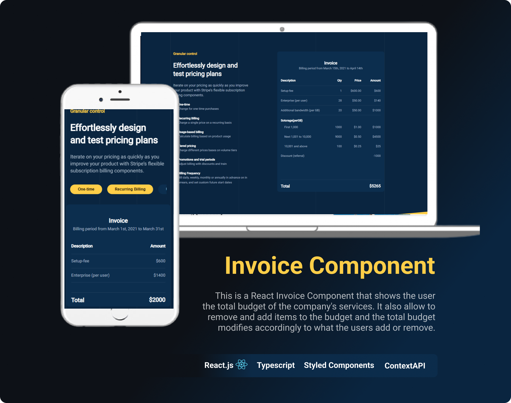

# INVOICE COMPONENT
## React web app
This is a React Invoice Component that shows the user the total budget of the company's services. It also allow to remove and add items to the budget and the total budget modifies accordingly to what the users add or remove.

[See the app](https://mcmpokedex.herokuapp.com](https://invoice-component.netlify.app)



### Technologies
* React.js
* React Hooks
* Typescript
* Styled-Components
* Vite

---
---

### Instalation
```Bash
  npm install
``` 
---
---

### Run
```Bash
  npm run dev
```
---
---

### Build
```Bash
  npm run build
```
